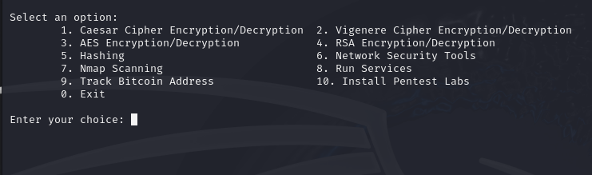

<pre>
 _____                 ____      _               
| ____|__ _ ___ _   _ / ___|   _| |__   ___ _ __ 
|  _| / _` / __| | | | |  | | | | '_ \ / _ \ '__|
| |__| (_| \__ \ |_| | |__| |_| | |_) |  __/ |   
|_____\__,_|___/\__, |\____\__, |_.__/ \___|_|   
                |___/      |___/                 
</pre>
# install & Run
```md
sudo git clone https://github.com/Ahmed0or1/EasyCyber.git
```
```md
cd EasyCyber
```

```md
sudo chmod 777 EasyCyber
```

```md
./EasyCyber
````
# =-=-=-=-=-=-=-=-=-=-=-=-=-=-=-=-=-=-=-=-=-=-=-=-=
# Run
```md
cd EasyCyber & ./EasyCyber
````

